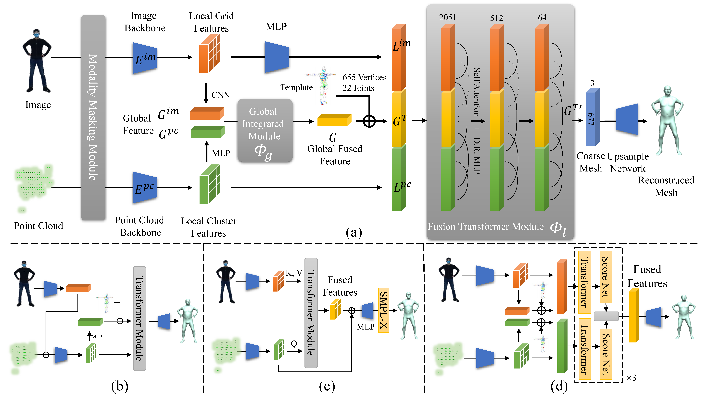

# ImmFusion: Robust mmWave-RGB Fusion for 3D Human Body Reconstruction in All Weather Conditions
## Project page
https://chen3110.github.io/ImmFusion/index.html

## Framework


## Install

Our codebase is developed based on [MeshGraphormer](https://github.com/microsoft/MeshGraphormer) and [MeshTransformer](https://github.com/microsoft/MeshTransformer). Please check [Install.md](https://github.com/microsoft/MeshGraphormer/blob/main/docs/INSTALL.md) to install the relevant dependencies. Please also consider citing them if you use this codebase.

## Download

The pre-trained models can be downloaded with the following command.
```bash
sh download_models.sh
```

Visit the following websites to download SMPL and SMPL-X models. 

- Download `basicModel_neutral_lbs_10_207_0_v1.0.0.pkl` from [SMPLify](http://smplify.is.tue.mpg.de/), and place it at `./src/modeling/data`.
- Download `SMPLX_NEUTRAL.pkl` from [SMPL-X](https://smpl-x.is.tue.mpg.de/), and place it at `./src/modeling/data`.

## Experiments
### Training
We use the following script to train on the mmBody dataset.

```bash
python ./run_immfusion.py \
    --output_dir output/immfusion \
    --dataset mmBodyDataset \
    --data_path datasets/mmBody \
    --mesh_type smplx \
    --model AdaptiveFusion \
    --per_gpu_train_batch_size 10 \
    --train /
```

### Testing

```bash
python ./run_immfusion.py \
    --output_dir output/immfusion \
    --resume_checkpoint output/immfusion/checkpoint \
    --dataset mmBodyDataset \
    --data_path datasets/mmBody \
    --mesh_type smplx \
    --model AdaptiveFusion \
    --test_scene lab1 \
```


## BibTeX
```
@inproceedings{chen2023immfusion,
  title={Immfusion: Robust mmwave-rgb fusion for 3d human body reconstruction in all weather conditions},
  author={Chen, Anjun and Wang, Xiangyu and Shi, Kun and Zhu, Shaohao and Fang, Bin and Chen, Yingfeng and Chen, Jiming and Huo, Yuchi and Ye, Qi},
  booktitle={2023 IEEE International Conference on Robotics and Automation (ICRA)},
  pages={2752--2758},
  year={2023},
  organization={IEEE}
}
```
